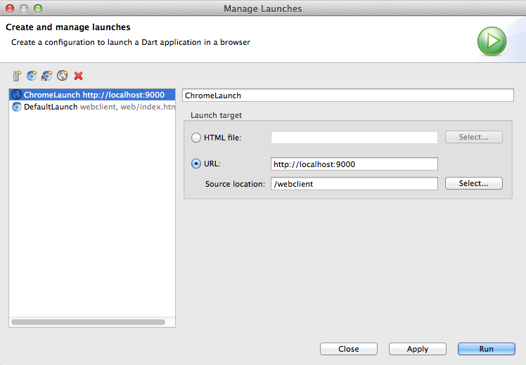
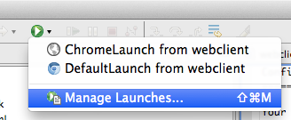

Configuring the launches
=========================

Your default launch will look like this:

If you want to have only the backend server and have your static files served from it, you first need to create a symlink of the public folder:

  $ backend git:(master) ✗ ln -s ../webclient/build/web/ public

And then, configure your launch like this:

Build your client with pub build and then execute with the appropiate launch configuration: 

Unfortunately DartEditor doesn't support a prelaunch step to do both things, the pub build and launch, in only one step.

Install Karma
=============

- Install Node: brew install node  (or download from http://nodejs.org/download/)

- Install Karma: npm install -g karma

- Install Karma-Dart: npm install -g karma-dart 

- Verify: karma --version

  if error -> include path in ~/.profile: PATH=$PATH:/usr/local/lib/node_modules/karma/bin

- Verify: dart --version && dart2js --version

  if error -> include path in ~/.profile: PATH=$PATH:"path-to-dart"/dart-sdk/bin

Run Karma
=========

  karma start karma.conf.js

WebClient
=========

Configure Server:

Puede solicitar datos de un servidor "real" o "simulado".

type( ServerRequest, implementedBy: DailySoccerServer )
or
type( ServerRequest, implementedBy: MockDailySoccerServer )

