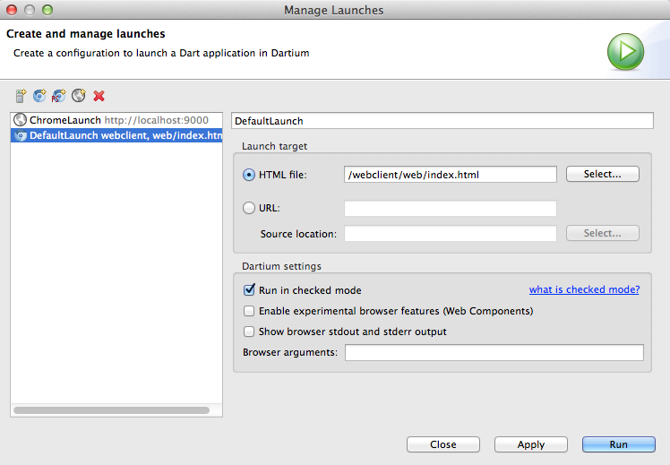

Testing
=============

- Install Node:

	$ webclient > brew install node
	
- Install the npm packages using:

	$ webclient > npm install

	This of course will create the "node_modules/" folder. Hide it in your DartEditor workspace by right-clicking 
	in the root project -> properties, and adding an Exclude filter under the Resources section.
	
- Verify that you have the "dart-sdk/bin" folder in your path: 
    
    $ webclient > dart --version && dart2js --version

  if you don't have it, just include the path in ~/.profile: PATH=$PATH:"path-to-dart"/dart-sdk/bin

- To run karma use the provided script:

  $ webclient > ./run_karma.sh

The browser is launched automatically by karma. You can access it at http://localhost:9876

- To compile automatically the web/less files to css, install grunt-cli and then just run grunt:
  
  + $ webclient > npm install -g grunt-cli
  + $ webclient > grunt
  
  If you need to compile the less files for production:
  
  $ webclient > grunt less:production
   

WebClient
=========

El cliente puede solicitar datos de un servidor "real" o "simulado". Para configurar esto, en webclient.dart:

bind(ServerRequest, toImplementation: DailySoccerServer)

or

type(ServerRequest, toImplementation: MockDailySoccerServer)

Configuring the launches
=========================

Your default launch will look like this:

The server uses CORS to allow the client to be executed in its own server (localhost:3000 or wherever). But you can also copy 
the output of "pub build" to the backend/public folder and execute directly with the server serving the client as static files.

